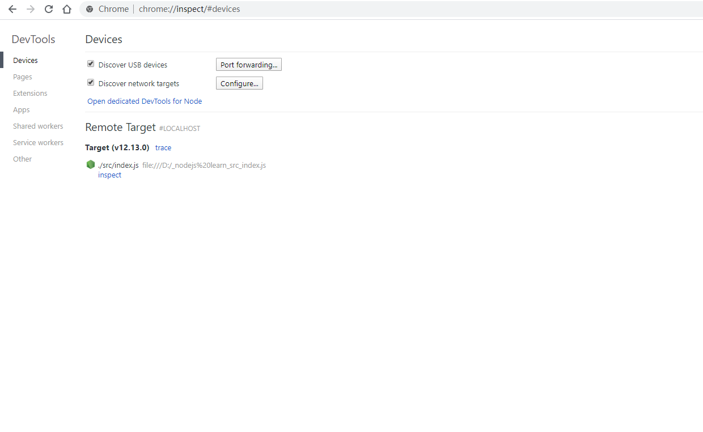

## 调试nodejs
编写完代码，一次就运行对的情况是很少的，经常需要debug来发现程序中的错误，通过浏览器开发者工具调试js代码是很方便的事件，nodejs也可以通过 Chrome DevTools 进行调试，主要步骤如下：

#### 前置条件
+ nodejs版本 v7.x.x+
+ Chrome 版本 55+

> 确认开启了“ 开发者工具实验性功能(Developer Tools experiments)”
> 在谷歌浏览器中打开[启动开发者工具实验性功能](chrome://flags/#enable-devtools-experiments)

#### 以调试模式启动nodejs文件
可以通过两种方式:
+ 使用参数`--inspect`，适用于调试异步代码，如接口请求、文件读取等等，如果代码中无异步代码，且node代码运行结束后会直接退出进程，则这种启动方式不适用
<pre><code>node --inspect ./src/index.js</code></pre>
+ 使用参数`--inspect-brk`，代码会在第一行break，然后开始调试代码
<pre><code>node --inspect-brk ./src/index.js</code></pre>

以第二种方式为例：
+ 启动nodejs

#### 在谷歌浏览器窗口中查看启动调试的nodejs文件列表
+ 在谷歌浏览器中打开[调试窗口](chrome://inspect/)，里面可以看到正在调试的文件列表（可能不是很灵敏）

#### 开始调试nodejs文件
+ 点击要调试的文件

可以看到nodejs在文件第一行处break了，这个时候就可以按照调试js代码的方式调试nodejs文件，快捷键保持不变

以调试模式启动nodejs进程后，还可以在谷歌浏览器中打开[http://127.0.0.1:9229/json/list](http://127.0.0.1:9229/json/list)，得到下面这样一个json文件，里面`devtoolsFrontendUrl`内容复制在一个空白页面打开，可直接进入到要调试的nodejs文件
<pre><code>[ {
  "description": "node.js instance",
  "devtoolsFrontendUrl": "chrome-devtools://devtools/bundled/js_app.html?experiments=true&v8only=true&ws=127.0.0.1:9229/e8b1fc4b-ab16-41c1-870d-b7ff69b7d4eb",
  "devtoolsFrontendUrlCompat": "chrome-devtools://devtools/bundled/inspector.html?experiments=true&v8only=true&ws=127.0.0.1:9229/e8b1fc4b-ab16-41c1-870d-b7ff69b7d4eb",
  "faviconUrl": "https://nodejs.org/static/images/favicons/favicon.ico",
  "id": "e8b1fc4b-ab16-41c1-870d-b7ff69b7d4eb",
  "title": "./src/index.js",
  "type": "node",
  "url": "file://D:_nodejs learn_src_index.js",
  "webSocketDebuggerUrl": "ws://127.0.0.1:9229/e8b1fc4b-ab16-41c1-870d-b7ff69b7d4eb"
} ]
</code></pre>

#### 以其他端口启动nodejs项目
在Chrome DevTools 中调试nodejs文件，默认使用的端口是启动9229，如果要使用其他端口调试nodejs文件，可以在后面加上`=[port]`，如使用9232，则应该这样：
<pre><code>node --inspect=9232 ./src/index.js</code></pre>
或
<pre><code>node --inspect-brk=9232 ./src/index.js</code></pre>

打开调试信息页可以看到新的调试参数(注意端口号也需要同步更改)[http://127.0.0.1:9232/json/list](http://127.0.0.1:9232/json/list)，得到以下数据
<pre><code>[ {
  "description": "node.js instance",
  "devtoolsFrontendUrl": "chrome-devtools://devtools/bundled/js_app.html?experiments=true&v8only=true&ws=127.0.0.1:9232/5cd50545-3f17-40fd-8211-ad8e40c46000",
  "devtoolsFrontendUrlCompat": "chrome-devtools://devtools/bundled/inspector.html?experiments=true&v8only=true&ws=127.0.0.1:9232/5cd50545-3f17-40fd-8211-ad8e40c46000",
  "faviconUrl": "https://nodejs.org/static/images/favicons/favicon.ico",
  "id": "5cd50545-3f17-40fd-8211-ad8e40c46000",
  "title": "./src/index.js",
  "type": "node",
  "url": "file://D:_nodejs learn_src_index.js",
  "webSocketDebuggerUrl": "ws://127.0.0.1:9232/5cd50545-3f17-40fd-8211-ad8e40c46000"
} ]</code></pre>
将相应路径拷贝出来在浏览器中打开可直接进入调试页面（注：实践中在chrome://inspect/页面貌似不会列出以非9229端口调试的文件）

#### 同时调试多个nodejs项目
以不同的端口启动调试，则可以同时调试多个项目，比如，对于一个项目，同时使用默认端口和9232端口启动调试时

可以同时看到两个相同的调试项目
 